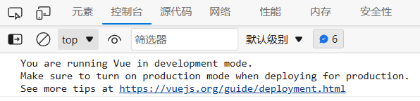
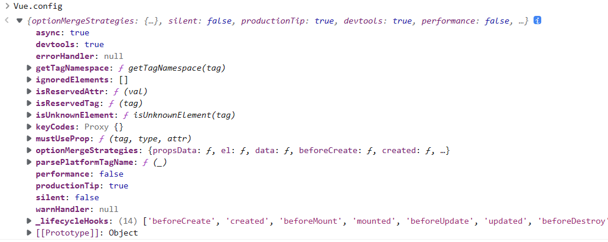
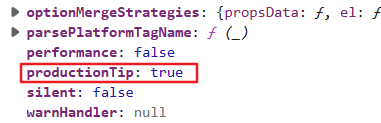
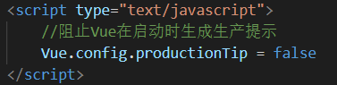
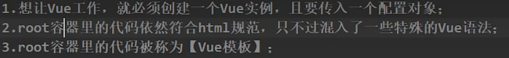
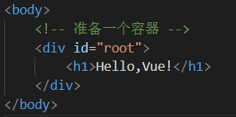
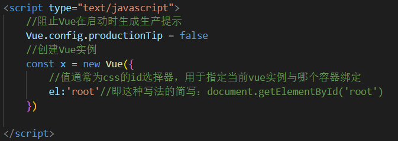
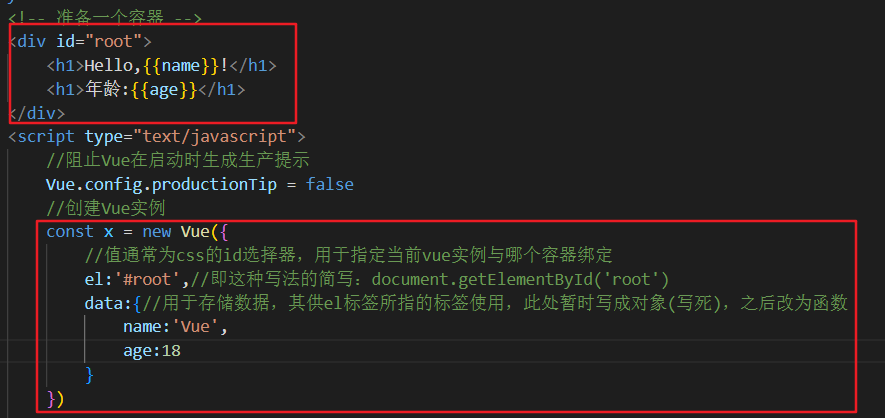

# 初识Vue
## 简介及初始开发环境搭建
如下图，在&#60;script&#62;标签中引入了vue.js之后
在控制台会有这个警示信息，告诉我们现在使用的是开发者版本的Vue，
如果现在是生产环境，希望换成生产环境的Vue

①在开发者工具中就通过Vue.config命令可以看到Vue的全局配置

②其中productionTip属性的值代表是否在启动时生成生产提示

③忽略该配置只需要在对应的h5文件中写对应的脚本，将其值改为false即可。

修改之后不起作用：
    原来我们刷新页面时，页面从上到下加载，先加载了vue.js文件
里面的config.productionTip，而我们是后面改的。
所以先弹出了警告，其实我们是有改到Vue.config.productionTip的。
## 写第一个Vue实例
流程：
1. 首先有一个模板，模板内有Vue语法的代码
2. 然后有Vue实例
3. 之后Vue实例找到自己el的值对应的模板
4. 将模板内对应Vue语法的代码替换
  

- 第一步，准备一个容器

- 第二步，创建Vue实例

- 第三步，开始使用Vue的方法

## 第一个Vue实例分析
1. 容器和Vue之间是<big>**一对一**</big>的关系
即：
  一个el:'#root'的Vue实例
  两个id="root"的容器
  该Vue实例只能获取到第一个id为root的容器 
  两个el:'#root'的Vue实例
  一个id="root"的容器
  只有第一个Vue实例只获取到id为root的容器
  第二个Vue实例毫无作用。
 
2. 容器{{}}里必须填写js表达式
   - 表达式：一个表达式会产生一个值。
    (1) a
    (2) a+b
    (3) Date.now()
    (4) x == y ? 'a' : 'b'
   - js代码:
    (1) if(){}
    (2) for(){}

