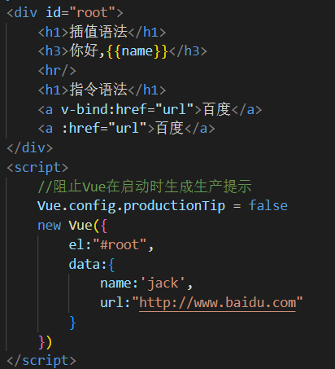

### Vue模板语法有两大类
1. **插值语法**：
   - 功能：
        用于解析标签体的内容
   - 写法：
        {{xxxx}}，xxx是js表达式，可以直接读取data中的所有属性。
2. **指令语法**:
   - 功能：
        用于解析标签自身(包括标签属性、标签体内容、绑定事件等)
    - 写法(举例)：
        \<a v-bind:href="xxx">，其中xxx也需要是js表达式
        也可以简写成：\<a :href="xxx">
    - 备注：
        Vue中有很多指令，形式都是：v-???。
        且只有 v-bind: 可以简写成 :

