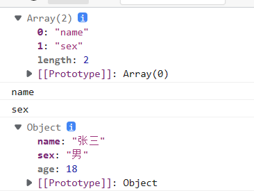
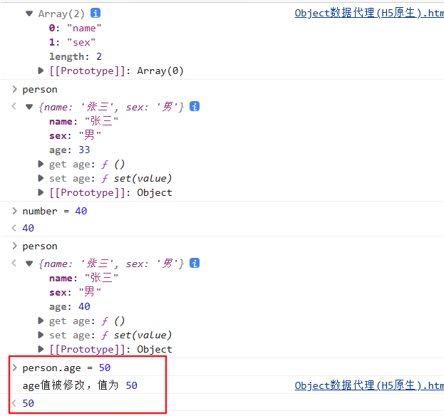

## 什么叫数据代理
&nbsp;&nbsp;&nbsp;&nbsp;通过一个对象代理对另一个对象中的属性的操作（读/写），就是数据代理。
例如：
&nbsp;&nbsp;&nbsp;&nbsp;
## 一、Object.defineProperty(原生数据代理)
**作用：**
&nbsp;&nbsp;&nbsp;&nbsp;该方法用来给一个对象添加属性
**参数说明：**
&nbsp;&nbsp;&nbsp;&nbsp;第一个参数表示被添加属性的对象，例如person
&nbsp;&nbsp;&nbsp;&nbsp;第二个参数表示添加属性的名字，例如age
&nbsp;&nbsp;&nbsp;&nbsp;第三个参数表示添加属性的值，例如{value:18}
 

**举例：**
&nbsp;&nbsp;&nbsp;&nbsp;接下来的代码都是使用这个，只修改 Object.defineProperty()中定义的代码
~~~ javascript
    
~~~

**1、enumerable**
&nbsp;&nbsp;&nbsp;&nbsp;(**不设置enumerable属性为true，被添加的属性无法被枚举**)
&nbsp;&nbsp;&nbsp;&nbsp;如下代码
~~~ javascript
        Object.defineProperty(person,'age',{
            value:18,
            //控制属性是否可以被枚举
            enumerable:true,
        })
~~~
&nbsp;&nbsp;&nbsp;&nbsp;输出结果
&nbsp;&nbsp;&nbsp;&nbsp;&nbsp;&nbsp;&nbsp;&nbsp;

**2、writable**
&nbsp;&nbsp;&nbsp;&nbsp;(**不设置writable属性为true，添加到属性无法被修改**)
&nbsp;&nbsp;&nbsp;&nbsp;如下代码
~~~ javascript
        Object.defineProperty(person,'age',{
            value:18,
            //控制属性是否可以被枚举
            enumerable:true,
            //控制属性是否可以被修改
            writable:true
        })
~~~
&nbsp;&nbsp;&nbsp;&nbsp;输出结果
&nbsp;&nbsp;&nbsp;&nbsp;&nbsp;&nbsp;&nbsp;&nbsp;.png)
变为：

**3、configurable**
&nbsp;&nbsp;&nbsp;&nbsp;(**不设置writable属性为true，添加的属性无法删除**)
&nbsp;&nbsp;&nbsp;&nbsp;如下代码
~~~ javascript
        Object.defineProperty(person,'age',{
            value:18,
            //控制属性是否可以被枚举
            enumerable:true,
            //控制属性是否可以被修改
            writable:true,
            //控制属性是否可以被删除
            configurable:true
        })
~~~
&nbsp;&nbsp;&nbsp;&nbsp;输出结果：注意，age是后面添加的
&nbsp;&nbsp;&nbsp;&nbsp;&nbsp;&nbsp;&nbsp;&nbsp;.png).png)
变为：
.png)

**4、get**
&nbsp;&nbsp;&nbsp;&nbsp;(**在每次该属性被读取时，get()函数会被调用，get()返回值就是该属性的值**)
&nbsp;&nbsp;&nbsp;&nbsp;如下代码
~~~ javascript
        let number = 33
        Object.defineProperty(person,'age',{
            //value:18,
            //控制属性是否可以被枚举
            //enumerable:true,
            //控制属性是否可以被修改
            //writable:true,
            //控制属性是否可以被删除
            //configurable:true,
            //在每次person.age被读取时，get()函数会被调用，get()返回值就是age的值
            get:function(){
                return number
            }
        })
~~~
&nbsp;&nbsp;&nbsp;&nbsp;输出结果：注意，age是后面添加的
&nbsp;&nbsp;&nbsp;&nbsp;可见，age这个属性需要调用getter()方法，这样age属性的的值 就和 number属性的值关联在一起了。
&nbsp;&nbsp;&nbsp;&nbsp;&nbsp;&nbsp;&nbsp;&nbsp;

**5、set**
&nbsp;&nbsp;&nbsp;&nbsp;(**在每次该属性被读取时，get()函数会被调用，get()返回值就是该属性的值**)
&nbsp;&nbsp;&nbsp;&nbsp;如下代码
~~~ javascript
        let number = 33
        Object.defineProperty(person,'age',{

            //在每次person.age被读取时，get()函数会被调用，get()返回值就是age的值
            get:function(){
                return number
            }
            //当有人修改该值(age)时，set()函数就会被调用，且会受到修改的具体值，即value
            set(value){
                console.log('age值被修改，值为',value)
            }
        })
~~~
&nbsp;&nbsp;&nbsp;&nbsp;输出结果：注意，age是后面添加的
&nbsp;&nbsp;&nbsp;&nbsp;&nbsp;&nbsp;&nbsp;&nbsp;

## 二、Vue数据代理
~~~ javascript
 

        <h2>学校名称:{{name}}</h2>
        <h2>学校地址:{{address}}</h2>
    

    
~~~
在开发者工具中查看vm的属性：
&nbsp;&nbsp;&nbsp;可以发现，在data中定义的两个属性直接出现在了vm对象内。
&nbsp;&nbsp;&nbsp;查看其时都是使用getter
&nbsp;&nbsp;&nbsp;修改时也是使用setter

**Vue对象中的data属性存在哪里？**
&nbsp;&nbsp;&nbsp;并不是vm.data，而是vm._data
&nbsp;&nbsp;&nbsp;在_data中虽然name=(...)，但这里**不是数据代理**，这里是**数据劫持**，为了实现响应式(当name发生改变，页面中所有的name也会随着改变)。
&nbsp;&nbsp;&nbsp;
**可以这样定义data：**
&nbsp;&nbsp;&nbsp;这样，vm._data = options.data = data
&nbsp;&nbsp;&nbsp;options是配置对象，因为new Vue的时候，使用的不是一个单独的对象，而是一个配置对象，所以vue从该配置对象获取值。
&nbsp;&nbsp;&nbsp;
**代理：**
&nbsp;&nbsp;&nbsp;所以Vue的代理为：
&nbsp;&nbsp;&nbsp;&nbsp;&nbsp;&nbsp;vm中的属性(name或address)去代理 vm._data中的name或address
&nbsp;&nbsp;&nbsp;&nbsp;&nbsp;&nbsp;即:
~~~ javascript
Object.defineProperty(vm,'name',{
            get(){
                return _data.name
            },
            set(value){
                _data.name = value
            }

        })
~~~
