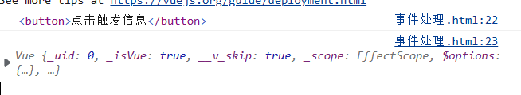
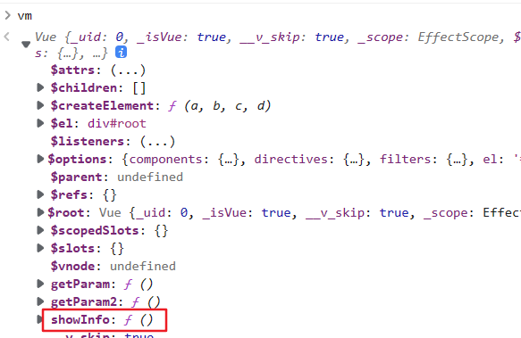
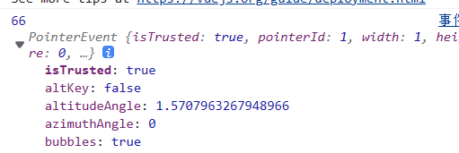

# 事件
## 1.事件绑定及传参(v-on:click 点击事件)
#### ①绑定事件
**源代码：**
&nbsp;&nbsp;&nbsp;a.通过v-on:clcik绑定一个函数
&nbsp;&nbsp;&nbsp;b.可以简写为 **@click**
&nbsp;&nbsp;&nbsp;注意，该函数**必须写在Vue实例的<u>methods</u>属性**中，否则绑定不到
&nbsp;&nbsp;&nbsp;被绑定的方法也属于vm对象，可以在vm对象中找到。
&nbsp;&nbsp;&nbsp;&nbsp;&nbsp;&nbsp;该方法也可以被写在data中，但是这样会被Vue错误的数据代理，会使Vue很庞大。
~~~ javascript
    

        <!-- v-on:click 表示点击时触发事件 -->
        <button v-on:click="showInfo">点击触发信息</button>
        <button @click="showInfo">点击触发信息2</button>
    

    
~~~
可见，该函数中this对象为Vue实例，参数envent就是该标签

#### ②传递参数
**源代码：**
&nbsp;&nbsp;&nbsp;直接在绑定的函数名后面加个()，()内填写参数。
&nbsp;&nbsp;&nbsp;触发事件event会被删除，想要保留需要使用占位符 **$event**
~~~ javascript
    

        <!-- 传递参数可以直接写个()，将参数写在()里 -->
        <button @click="getParam(66)">参数获取</button>
        <!-- 传递参数之后event会被覆盖，使用$event占位符可以保留 -->
        <button @click="getParam2(66,$event)">参数获取</button>
    

    
~~~

## 2.事件修饰符
#### ①引入
&nbsp;&nbsp;&nbsp;对于&lt;a&gt;，给其绑定事件之后，事件执行完毕，其会跳转到href所指定的网址。
&nbsp;&nbsp;&nbsp;如何阻止其默认的行为呢？
&nbsp;&nbsp;&nbsp;&nbsp;&nbsp;&nbsp;①通过event的preventDefault()方法阻止默认行为。
&nbsp;&nbsp;&nbsp;&nbsp;&nbsp;&nbsp;②使用**访问修饰符**，在绑定事件的命令后加.prevent即可，例如：@click.prevent
~~~ javascript
    

        <a href="http://www.baidu.com" @click="test">事件修饰符</a>
        <a href="http://www.baidu.com" @click.prevent="test">事件修饰符2</a>
    

    
~~~
#### ①Vue提供的时间修饰符
**stop：阻止事件冒泡(常用)**
&nbsp;&nbsp;&nbsp;事件冒泡就是当一个HTML元素出发一个事件时，它的祖先节点都会收到该事件。
~~~ html
    <!-- 阻止单击事件继续传播 -->
    

        <!-- 如果click事件不添加stop修饰符，点击click会触发两次doThis方法 -->
        
    

~~~
**prevent：阻止默认事件(常用)**
~~~ html
    <!-- 提交事件不再重载页面 -->
    <form v-on:submit.prevent="onSubmit"></form>
    <!-- a标签的默认跳转事件不再被触发 -->
    <a href="http://www.baidu.com" @click.prevent="test">prevent</a>
~~~
**once:事件只触发一次(常用)**
~~~ html
    <!-- 点击事件将只有第一次会触发一次，多次点击失效 -->
    
~~~
**capture：使用事件的捕获模式**
~~~ html
    <!-- 添加事件监听器时使用事件捕获模式 -->
    <!-- 即内部元素触发的事件先在此处理，然后才交由内部元素进行处理 -->
    
...

~~~
**self**
~~~ html
    <!-- 只当在 event.target 是当前元素自身时触发处理函数 -->
    <!-- 即事件不是从内部元素触发的 -->
    
...

~~~
**passive**
~~~ html
    <!-- 滚动事件的默认行为 (即滚动行为) 将会立即触发 -->
    <!-- 而不会等待 `onScroll` 完成  -->
    <!-- 这其中包含 `event.preventDefault()` 的情况 -->
    
...

~~~
**注意：**
&nbsp;&nbsp;&nbsp;访问修饰符可以串联
~~~ html
    <!-- 修饰符可以串联 -->
    
~~~

