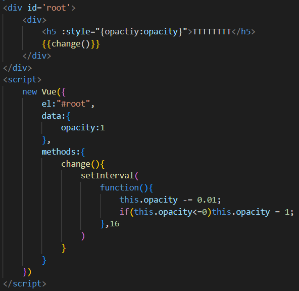
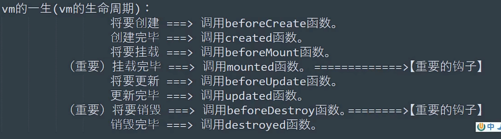
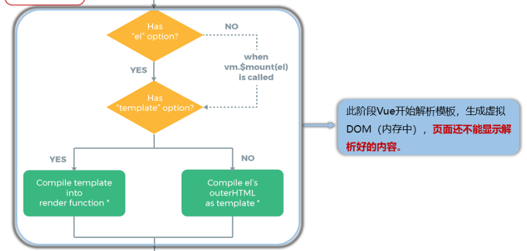
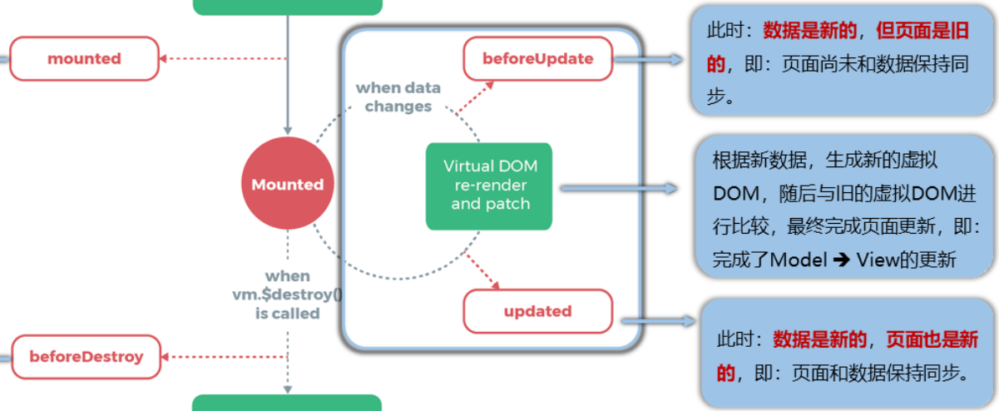
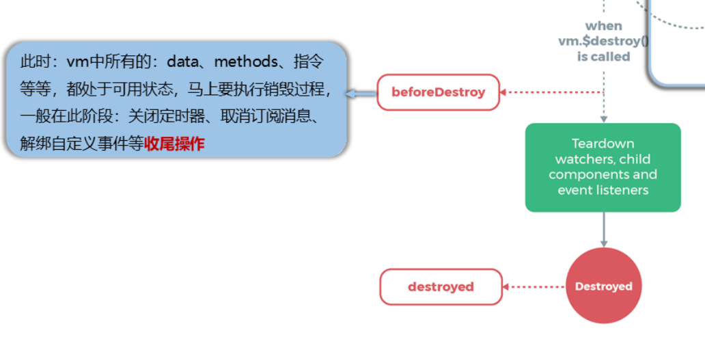

## 一、引入生命周期
### 需求：
&nbsp;&nbsp;&nbsp;&nbsp;需要让一段文字透明度从1缓慢变为0
#### 解决方法：
&nbsp;&nbsp;&nbsp;&nbsp;给文字添加style样式，其opacity值为Vue管理的data中的值
&nbsp;&nbsp;&nbsp;&nbsp;在methods中写一个函数，用来开启一个定时器，改变opacity的值
&nbsp;&nbsp;&nbsp;&nbsp;最后，需要调用这个方法
&nbsp;&nbsp;&nbsp;&nbsp;&nbsp;&nbsp;&nbsp;&nbsp;使用插值语法调用该函数
&nbsp;&nbsp;&nbsp;&nbsp;&nbsp;&nbsp;&nbsp;&nbsp;&nbsp;&nbsp;&nbsp;&nbsp;(因为该方法无返回值，因此使用插值语法不会显示)
&nbsp;&nbsp;&nbsp;&nbsp;&nbsp;&nbsp;&nbsp;&nbsp;作为事件回调使用，但是不符合题意，不能使用按钮点击等事件手动控制效果

**代码:**

**问题：**
&nbsp;&nbsp;&nbsp;&nbsp;如上图代码，文字的opacity属性可以使用函数change()通过定时器改变
&nbsp;&nbsp;&nbsp;&nbsp;Vue会保证，当data里的值改变，会重新解析模板(html部分)
&nbsp;&nbsp;&nbsp;&nbsp;这样，每次定时器修改opacity属性，都会重新解析
&nbsp;&nbsp;&nbsp;&nbsp;每次解析都会调用change()方法开启新的定时器，指数爆炸

**如何解决呢？**
&nbsp;&nbsp;&nbsp;&nbsp;如果可以只调用一次change()方法，只开启一个定时器就解决这个问题了
这个时候就引入了挂载的概念：
&nbsp;&nbsp;&nbsp;&nbsp;&nbsp;&nbsp;&nbsp;&nbsp;Vue会首先对页面中的元素进行解析，然后对所有的元素初始化，生成虚拟Dom，然后再把真实Dom放入页面。
&nbsp;&nbsp;&nbsp;&nbsp;&nbsp;&nbsp;&nbsp;&nbsp;**将真实Dom放入真实页面的时刻就叫挂载。**
&nbsp;&nbsp;&nbsp;&nbsp;Vue会在完成挂载后，调用一个名为 **mounted()** 的方法，**只调用这一次**(在初始化完成，挂载到页面上后调用一次)
&nbsp;&nbsp;&nbsp;&nbsp;(注意，mounted()与data、methods等同级)
如果在挂载时开启定时器，就可以完成上面的需求了：

## 二、Vue的生命周期
- 生命周期又名：生命周期回调函数、生命周期函数
- 生命周期是什么：在Vue执行的特殊阶段执行特定名称的函数
- 生命周期函数的名称不可更改，但是内容由自己定义
- 生命周期函数中this指向vm或组件实例对象

接下来介绍部分重要的生命周期函数：
### 1.挂载
对比上面生命周期图，本部分讲述：
- 初始化阶段1(beforeCreate)
- 初始化阶段2(created)
- 解析阶段(代码中未体现，下面进行简介)
- 解析结束生成虚拟DOM阶段(beforeMount)
- 虚拟DOM转为真实DOM阶段(mounted,即挂载阶段)
  
**第3阶段解析阶段代码中未说明，此处简介：**
&nbsp;&nbsp;&nbsp;&nbsp;如下图，首先判断是否有el选项：
&nbsp;&nbsp;&nbsp;&nbsp;&nbsp;&nbsp;&nbsp;&nbsp;有，则进入下一个判断
&nbsp;&nbsp;&nbsp;&nbsp;&nbsp;&nbsp;&nbsp;&nbsp;没有，则等待接收Vue实例的对象(一般用vm接收)的方法vm.$mount(el)被调用，然后进如下一个判断
&nbsp;&nbsp;&nbsp;&nbsp;接下来判断是否有模板template:
&nbsp;&nbsp;&nbsp;&nbsp;&nbsp;&nbsp;&nbsp;&nbsp;有，则直接加载模板。注意，模板的根标签不被解析
&nbsp;&nbsp;&nbsp;&nbsp;&nbsp;&nbsp;&nbsp;&nbsp;没有，则直接将el锁绑定的html部分作为标签。注意，el所绑定的html的根标签(即div id="root")也会作为模板的一部分，被解析

**其他阶段代码解释：**
~~~ html

        n:{{n}}<button @click="add">n+1</button>
    

    
~~~
### 2.更新
更新部分的生命周期在挂载之后，销毁之前：

此部分有两个阶段：
- beforeUpdate:有数据更新，数据为新，页面为旧
- 然后生成新的虚拟DOM，与旧DOM比较，完成新的页面更新
- updated:数据和页面都更新完毕

**代码**
~~~ html
    

        n:{{n}}<button @click="add">n+1</button>
    

    
~~~

### 3.销毁
此阶段处于挂载阶段之后：
也是分为两个阶段：
- beforeDestory:Vue中所有的data、methods等都可用，在此阶段一般：
  - 关闭定时器、取消订阅消息、解绑自定义事件等
- destoryed：销毁

注意，在beforeDestory阶段可以访问到所有的data,methods等，但是页面的数据不会更新了。
注意，调用了vm.$destory()之后，Vue的成果还在，只是不会再更新;
例如v-bind等绑定的按钮事件等还可以点击，事件也会触发，因为这是Vue通过原生的h5进行绑定的。
