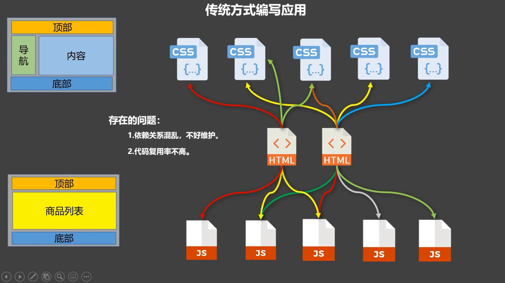
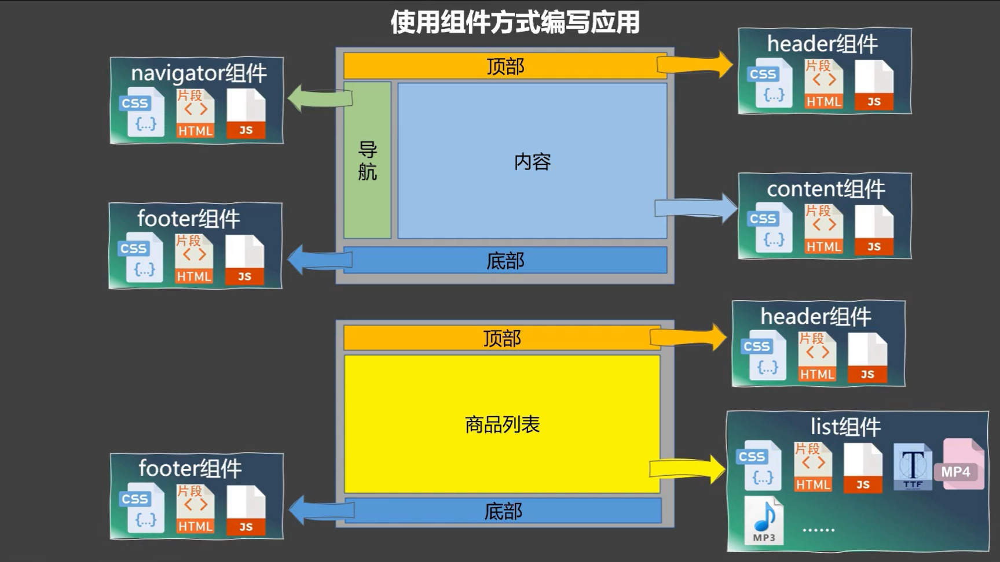

## 一、引入
**定义：**
&nbsp;&nbsp;&nbsp;&nbsp;用来实现局部功能的代码和资源的集合（html/css/js/image…）
**传统编写模式复用困难，结构混乱，因此引入Vue的组件模式**
传统前端编写方式：

Vue组件：

## 二、基础使用
&nbsp;&nbsp;&nbsp;&nbsp; 最开始是直接New一个VUE实例，并没有使用到组件
现在使用组件：
### 1. 创建组件
使用Vue的方法 **Vue.extend()** 来创建组件
与原来的使用不同之处：
&nbsp;&nbsp;&nbsp;&nbsp; ①不能使用el来绑定h5的容器了
&nbsp;&nbsp;&nbsp;&nbsp;&nbsp;&nbsp;&nbsp;&nbsp;因为这里相当于只是声明变量，这是个组件，要由VM来决定服务哪个容器
&nbsp;&nbsp;&nbsp;&nbsp;②data的定义不能使用之前的对象式写法了(data:{})，要使用函数式( **data(){return{}}** )
&nbsp;&nbsp;&nbsp;&nbsp;&nbsp;&nbsp;&nbsp;&nbsp;因为使用对象式的话，组件无法复用了(Vue会直接报错)。当一个组件被多个地方使用，**任何一个地方组件中属性的改变都会影响到其他地方的值。**
&nbsp;&nbsp;&nbsp;&nbsp;③组件里需要有template，用来表示html的基本结构

~~~ js
//一、创建组件
    //创建学生组件
    const student = Vue.extend({
        template:`
            

                <h1>学生信息:姓名:{{name}},年龄:{{age}}</h1>
                <button @click="show">点击显示姓名</button>
            

        `,
        data(){
            return{
                name:'张三',
                age:18
            } 
        },
        methods:{
            show(){
                window.alert(this.name);
            }
        }
    })
    //创建学校组件
    const school = Vue.extend({
        template:`
            

                <h1>学校信息:姓名:{{name}},年龄:{{age}}</h1>
            

        `,
        data(){
            return{
                name:'张三学校',
                age:18
            } 
        }
    })
~~~

### 2. 注册组件
注册分为全局注册和局部注册：
①全局注册:
&nbsp;&nbsp;&nbsp;&nbsp;全局注册的组件，如果new了多个Vue对象，都可以直接使用注册的组件，而不用每一个都去注册
②局部注册：
&nbsp;&nbsp;&nbsp;&nbsp;在new出来的Vue对象的components中注册组件:
&nbsp;&nbsp;&nbsp;&nbsp;&nbsp;&nbsp;&nbsp;&nbsp;key为组件之后的名字
&nbsp;&nbsp;&nbsp;&nbsp;&nbsp;&nbsp;&nbsp;&nbsp;value式定义的组件
~~~ js 
//二、注册组件
    //全局注册：
    Vue.component('student',student)
    //局部注册:
    new Vue({
        el:"#root",
        //components中的key为组件之后的名字，value式定义的组件
        components:{
            xiaoming:student,
            xuexiao:school
        }
    })
~~~

### 3. 使用组件
&nbsp;&nbsp;&nbsp;&nbsp; 直接在html里将注册的组件当作标签使用即可
~~~ html
    

        <xiaoming></xiaoming>
        <xuexiao></xuexiao>
    

~~~
