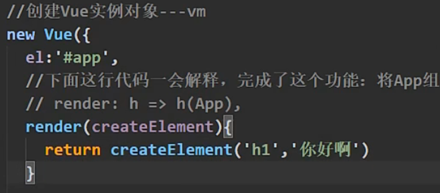
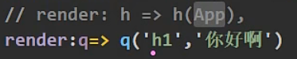

### 1. Vue.js
&nbsp;&nbsp;&nbsp;&nbsp;首先，需要了解vue.js的组成：
&nbsp;&nbsp;&nbsp;&nbsp;其包含两部分:
&nbsp;&nbsp;&nbsp;&nbsp;&nbsp;&nbsp;&nbsp;&nbsp;Vue核心,即那些指令等信息
&nbsp;&nbsp;&nbsp;&nbsp;&nbsp;&nbsp;&nbsp;&nbsp;模板解析器(占据约33%体积)，即将.vue文件解析为.html、.js等文件的解析器
&nbsp;&nbsp;&nbsp;&nbsp;然而在开发中，打包前端项目都是使用cli脚手架或者webpack等工具，不需要vue自己去打包，因此在打包之后因该舍去vue.js中模板解析器部分。
### 2.npm run serve
&nbsp;&nbsp;&nbsp;&nbsp;①在src文件夹下找到main.js并执行
&nbsp;&nbsp;&nbsp;&nbsp;&nbsp;&nbsp;&nbsp;&nbsp;配置各种工具，主要是导入各种包(vue、router等)以及导入App.vue以及创建Vue实例。
&nbsp;&nbsp;&nbsp;&nbsp;②找到App.vue文件，在里面配置所有的组件
&nbsp;&nbsp;&nbsp;&nbsp;③在main.js配置完之后，在public文件夹中找到index.html作为容器
&nbsp;&nbsp;&nbsp;&nbsp;④最后在index.html中配置各种组件

### 3.mian.js中导入的vue
&nbsp;&nbsp;&nbsp;&nbsp;导入的vue并非完整版，原因如上述1中所诉，因为导入的包不完整，因此无法将.vue文件解析，直接运行浏览器会不认识。
&nbsp;&nbsp;&nbsp;&nbsp;因此需要其他工具：
&nbsp;&nbsp;&nbsp;&nbsp;&nbsp;&nbsp;&nbsp;&nbsp;借助render()函数来导入模板,其可以接收参数,并且需要返回可以精简到第二张图

