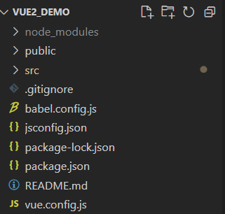
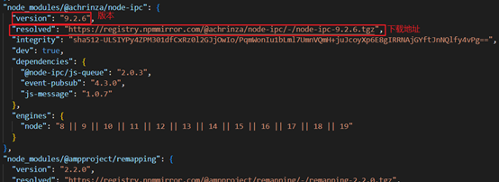

## 一、Vue目录

### 1.分析最外层目录的文件
**1.babel.config.js**
&nbsp;&nbsp;&nbsp;&nbsp;babel配置文件，将es6转为es5，不需要配置(官方配置即可)
**2.package.json**
&nbsp;&nbsp;&nbsp;&nbsp;符合npm规则的项目都有的文件，表示包的说明书

**3.package-lock.json**
&nbsp;&nbsp;&nbsp;&nbsp;也是符合npm规则的项目都有的文件。顾名思义，锁住包，就是将包的版本以及下载地址等全部锁住，文件里记录了项目中每个包的版本和安装地址等信息。

### 2.分析src目录下文件

**①mian.js**
&nbsp;&nbsp;&nbsp;&nbsp;执行npm run serve命令会去执行main.js，程序的总入口。
~~~ js
//引入vue
import Vue from 'vue'
//引入App组件，即所有组件的父组件
import App from './App.vue'
//关闭开发环境提示
Vue.config.productionTip = false

//创建Vue实例对象(vm)
new Vue({
  //作用是将App组件放入容器中
  render: h => h(App),
}).$mount('#app')
/*
  相当于
  new Vue({
            el:"#app",
            //作用是将App组件放入容器中
            render(createElement){
              return createElement(组件)
            }
        })
*/
~~~
**vue3的mian.js有些不同**
~~~ js
//不再引入vue构造函数，引入名为createApp的工厂函数，不需要new了，直接调用即可
import { createApp } from 'vue'
//引入App组件，即所有组件的父组件
import App from './App.vue'

import './registerServiceWorker'

//作用就是挂载
createApp(App).mount('#app')
/*
    上面代码相当于：
    const app = createApp(App)//创建实例对象,类似于之前的vm，但是app比vm更轻量级
    app.mount('#app')//为其绑定吧id为app的容器，相当于之前的vm.$mount('#app')

*/
~~~
**②App.vue**
&nbsp;&nbsp;&nbsp;&nbsp;所有组件的父组件，在单文件组件中已经解释
**③components文件夹**
&nbsp;&nbsp;&nbsp;&nbsp;里面存放着所有的组件
**③Assets**
&nbsp;&nbsp;&nbsp;&nbsp;存放着静态文件，例如图片、视频等

### 3.public文件夹

**1.favicon.ioc**
&nbsp;&nbsp;&nbsp;&nbsp;网站的图标，会在index.html中引用
**2.index.html**
&nbsp;&nbsp;&nbsp;&nbsp;前面src文件夹已经将所有东西配置好了，只缺一个容器，这个index.html就是这个容器。（注意，只有这一个html文件，因为Vue是单页面应用）
~~~ html
<!DOCTYPE html>
<html lang="">
  <head>
    <meta charset="utf-8">
    <!-- 针对IE浏览器的一个特殊配置，让IE浏览器以最高渲染级别渲染页面 -->
    <meta http-equiv="X-UA-Compatible" content="IE=edge">
    <!-- 开启移动端的理想视口 -->
    <meta name="viewport" content="width=device-width,initial-scale=1.0">
    <!-- 配置页签图标(<%= BASE_URL %>作用表示public文件夹，防止发布后因为./../等出现的路径问题) -->
    <link rel="icon" href="<%= BASE_URL %>favicon.ico">
    <!-- 配置页面标题(<%= htmlWebpackPlugin.options.title %>表示到package.json文件中找name属性) -->
    <title><%= htmlWebpackPlugin.options.title %></title>
  </head>
  <body>
    <!-- 当浏览器不支持js时，<noscript>中的标签就会被渲染 -->
    <noscript>
      <strong>We're sorry but <%= htmlWebpackPlugin.options.title %> doesn't work properly without JavaScript enabled. Please enable it to continue.</strong>
    </noscript>
    <!-- 自己的容器 -->
    

  </body>
</html>
~~~
