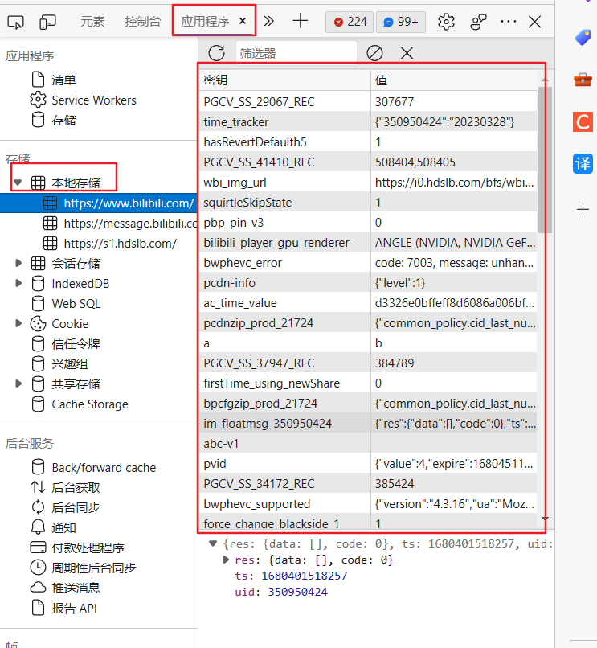
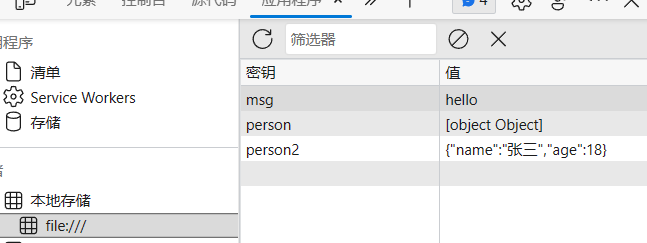

### 一、本地存储查看位置
&nbsp;&nbsp;&nbsp;&nbsp;注意，在不同网页打开，显示的都是该网页的本地存储

### 二、localStorage
&nbsp;&nbsp;&nbsp;&nbsp;特点：
&nbsp;&nbsp;&nbsp;&nbsp;&nbsp;&nbsp;&nbsp;&nbsp;浏览器关闭掉，数据依然存在
**1.保存数据**
&nbsp;&nbsp;&nbsp;&nbsp;注意，保存对象时需要使用JSON.toString()做转换
~~~ js
   

        <button onclick="savedata()">点击向localStorage保存信息</button>
    

    
~~~

**2.读取、删除、清空**
~~~js
    function readdata(){
        //读取
        let obj = localStorage.getItem('person2')
        console.log(obj)
    }
    function deletedata(){
        //删除
        localStorage.removeItem('msg')
    }
    function deleteAlldata(){
        //清空
        localStorage.clear()
    }
~~~

### 三、sessionStorage
&nbsp;&nbsp;&nbsp;&nbsp;方法与localStorage一模一样
&nbsp;&nbsp;&nbsp;&nbsp;二者唯一的区别就是这个在每次关掉之后，都会清空