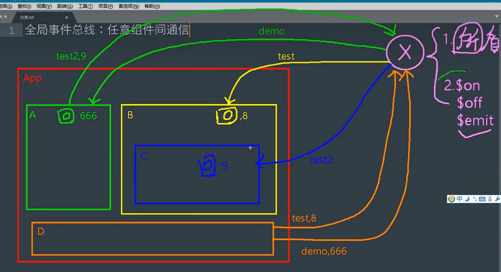

### 引入
&nbsp;&nbsp;&nbsp;&nbsp;当兄弟组件或任意组件之间想要传递数据，该怎么做?
&nbsp;&nbsp;&nbsp;&nbsp;如下图，我们可以使用一个不属于任何组件的东西(x)来充当传递数据的工具。

根据上图，这个工具x需要有两个要求：
&nbsp;&nbsp;&nbsp;&nbsp;①可以被所有组件看到
&nbsp;&nbsp;&nbsp;&nbsp;②具有\&on、\$off、\$emit三个属性，可以绑定事件来传递数据
&nbsp;&nbsp;&nbsp;&nbsp;因此，我们可以直接使用new出来的那个Vue对象(vm)，这个对象可以被所有子组件(vc)看到，且具有上述三个属性。
### 使用
**1.在mian.js中配置全局事务总线**
&nbsp;&nbsp;&nbsp;&nbsp;首先，我们已经在main.js中new了一个vm了，如何给其添加一个属性，充当全局事务总线呢？
&nbsp;&nbsp;&nbsp;&nbsp;&nbsp;&nbsp;&nbsp;&nbsp;放在new Vue()后面太迟了，因为这个时候所有组件都加载完毕了
&nbsp;&nbsp;&nbsp;&nbsp;&nbsp;&nbsp;&nbsp;&nbsp;放在new Vue()之前太早了，这时所有vm还未被new出来
这个时候，可以使用生命周期钩子：
&nbsp;&nbsp;&nbsp;&nbsp;在beroreCreate()钩子中，此时vm被创建，可以在此时创建这个全局事务总线：
&nbsp;&nbsp;&nbsp;&nbsp;注意：**vue.prototype**中设置的变量所有vc都可用。
&nbsp;&nbsp;&nbsp;&nbsp;命名为\$bus原因:\$是约定俗成，bus代笔总线
~~~ js
    new Vue({
    el:"#app",
    render: h => h(App),
    router:router,
    beforeCreate(){
        Vue.prototype.$bus = this
    }
    })
~~~
**2.在子组件中使用**
&nbsp;&nbsp;&nbsp;&nbsp;因为在vm中创建了prototype.\$bus属性，所以子组件都可以直接访问到。
①接收方
&nbsp;&nbsp;&nbsp;&nbsp;brother1组件来接收数据，可以在挂载结束后给\&bus监听一个自定义事件，此时该事件的回调在brother1身上
代码：
&nbsp;&nbsp;&nbsp;&nbsp;brother1的data中有个属性d，来接收传来的值。
&nbsp;&nbsp;&nbsp;&nbsp;brother1的methods中有个方法getParam，来处理接收来的值。
&nbsp;&nbsp;&nbsp;&nbsp;brother1的mounted()中为bus绑定了一个自定义函数，回调函数为getParam。
&nbsp;&nbsp;&nbsp;&nbsp;注意，不要忘了在钩子beforeDestory中解绑监听这个事件

~~~ html
<template>
    

        <h4>兄弟1</h4>
        兄弟传来的值：   {{ d }}
    

</template>

~~~
②发送方
&nbsp;&nbsp;&nbsp;&nbsp;给按钮绑定一个方法，在方法中给bus绑定一个自定义事件，同时将数据传递过去
~~~ html
<template>
    

        <h4>兄弟2</h4>
        <button @click="btn">点击传送数据</button>
    

</template>

~~~
