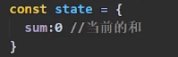

###一、基本概念和使用场景
**1.基本概念**
&nbsp;&nbsp;&nbsp;&nbsp;1.首先它是一个插件。使用 Vue.use(Vuex)引入
&nbsp;&nbsp;&nbsp;&nbsp;2.是一种组件间通信的方式，适用于任意组件间通信。
流程：
1. 组件调用dispatch('methodname',params),两个参数：调用action中的方法名和参数，作用是因为可能参数需要后端的api，所以多此一举
2. 在action中调用commit('methodname',params)两个参数：调用mutations中的方法名和参数，组件也可以直接调用commit()
3. 在mutations中可以获取到state中的数据以及传递来的参数，然后可以使用对参数操作
4. 最后state修改完毕调用render，重新渲染页面

**2.使用场景**

###二、基本使用
**1.安装vux**
&nbsp;&nbsp;&nbsp;&nbsp;Vue2需要使用vuex3版本，因为版本更新，默认安装就是vuex4版本(对应Vue3)
~~~ node
npm i vuex  //Vue3
npm i vuex@3
~~~
**2.使用vuex插件**
&nbsp;&nbsp;&nbsp;&nbsp;使用了vuex插件之后，创建vm时，就可以引入store对象了
&nbsp;&nbsp;&nbsp;&nbsp;就像是引入router插件之后，就可以在创建vm时，传入一个route(里面存放着规定的路由规则)一样
**注意:**
&nbsp;&nbsp;&nbsp;&nbsp;这一步不能放在main.js中使用，因为创建store时需要使用vuex实例，此时引入，在第三步创建store中，会报错必须先引入vuex(**引入模块时，会先执行模块内部的所有代码，且vue会将import的所有模块语句先执行**)
&nbsp;&nbsp;&nbsp;&nbsp;所以这一步放到store文件夹的index.js中
~~~js
//引入vuex
import Vuex from 'vuex'
//使用vuex插件
Vue.use(Vuex)
~~~
**3.store**
&nbsp;&nbsp;&nbsp;&nbsp;管理Actions、Mutations、State
&nbsp;&nbsp;&nbsp;&nbsp;①在src目录下创建一个文件夹store
&nbsp;&nbsp;&nbsp;&nbsp;②在store文件夹下创建一个index.js
&nbsp;&nbsp;&nbsp;&nbsp;③在index.js中创建store
~~~ js
//本文件用于创建vuex中的核心：store

//引入Vuex
import Vuex from 'vuex'
//引入Vue
import Vue from 'vue'

//使用vuex插件
Vue.use(Vuex)

//准备actions:用于响应组件中的动作
const actions = {

}

//准备mutations:用于操作数据(state状态)
const mutations = {

}

//准备state:用于存储数据(状态)
const state = {

}

//创建Store并暴露
export default new Vuex.Store({
    actions:actions,
    //重名了直接简写
    mutations,
    state
})
~~~
**4.让vc看到store**
&nbsp;&nbsp;&nbsp;&nbsp;①在mian.js中引入store文件夹下的index
&nbsp;&nbsp;&nbsp;&nbsp;②在vm实例对象中使用store
~~~js
//引入store
import store from '@/store/index'
//创建Vue实例
new Vue({
  el:"#app",
  render: h => h(App),
  store,//引入store,因为重名所以简写
  router:router,
  beforeCreate(){
      Vue.prototype.$bus = this
  }
})
~~~
###三、在组件中使用
**1.将共享的数据交给state管理**

**2.在actions中添加对象**
&nbsp;&nbsp;&nbsp;&nbsp;**业务逻辑写在这里面，如图三**
&nbsp;&nbsp;&nbsp;&nbsp;在action中添加的对象一般是方法，因此直接简写
&nbsp;&nbsp;&nbsp;&nbsp;方法名就是之后使用时的名字，方法都有两个参数
&nbsp;&nbsp;&nbsp;&nbsp;&nbsp;&nbsp;&nbsp;&nbsp;第一个参数就是上下文，代表可能会用到的东西，其中最重要的就是commit(来调用mutations中的方法)(下图2)
&nbsp;&nbsp;&nbsp;&nbsp;&nbsp;&nbsp;&nbsp;&nbsp;第二个参数就是组件中调用时传入的参数
&nbsp;&nbsp;&nbsp;&nbsp;注意，一般mutations中属性大写，actions中小写

**3.在mutations中添加对象**
&nbsp;&nbsp;&nbsp;&nbsp;第一个参数就是state，里面有get、set等方法还有对应属性(本例中sum)
&nbsp;&nbsp;&nbsp;&nbsp;第二个参数就是actions中对象传来的参数

**4.组件中使用**
&nbsp;&nbsp;&nbsp;&nbsp;通过this.\$store.dispatch()来嗲用actions中的方法，第一个参数为方法名，第二个参数为传入的参数

&nbsp;&nbsp;&nbsp;&nbsp;也可以直接调用commit

&nbsp;&nbsp;&nbsp;&nbsp;在模板中使用
