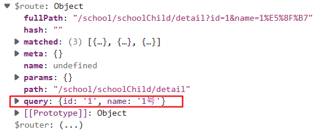
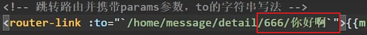
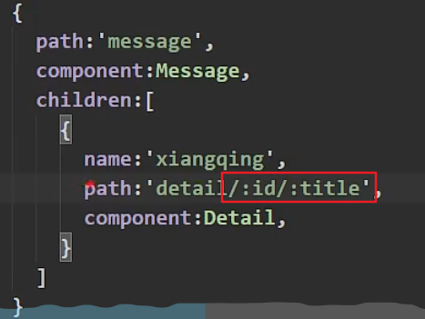
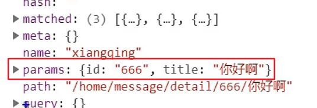
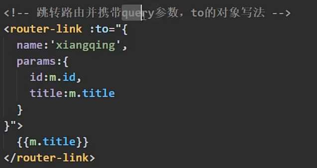

### 一、query传参
query传参是指在请求路径url后面添加参数，例如http://xxx/zzz?a=?&b=?
**1.在父组件中配置参数**
&nbsp;&nbsp;&nbsp;&nbsp;在router-link 的 to属性中添加参数，建议使用对象式：
&nbsp;&nbsp;&nbsp;&nbsp;&nbsp;&nbsp;&nbsp;&nbsp;path中写路径
&nbsp;&nbsp;&nbsp;&nbsp;&nbsp;&nbsp;&nbsp;&nbsp;query中写参数
~~~ html
<ul>
            <!-- 跳转路由并携带query参数 -->
            <!-- <li v-for="m in mslist" :key="m.id" ><router-link :to="'/school/schoolChild/detail?id=${m.id}&name=${m.name}'">消息{{ m.id }}</router-link></li> -->
            <!-- 跳转路由携带query参数,to的对象写法 -->
            <li v-for="m in mslist" :key="m.id" >
                <router-link :to="{
                    path:'/school/schoolChild/detail',
                    query:{
                        id:m.id,
                        name:m.name
                    }
                }">
                    消息{{ m.id }}
                </router-link>
            </li>    
        </ul>
~~~
**2.在子组件中使用参数**
&nbsp;&nbsp;&nbsp;&nbsp;这些东西会被router解析，存放到对应组件的$route.query中

&nbsp;&nbsp;&nbsp;&nbsp;在对应组件中获取参数就可以直接使用this.query获取参数了
~~~ html
<template>
    

        <ul>
            <li>消息编号:{{ $route.query.id }}</li>
            <li>消息内容:{{ $route.query.name }}</li>
        </ul>
    

</template>
~~~
### 二、params传参
**1.在父组件中配置参数**
①直接在url中拼接

这种方式需要在配置的路由里使用占位符

②to的对象式写法
注意，这种写法不能使用path属性表示路径
必须使用name属性

**2.在子组件中使用参数**
直接使用$route.params使用即可