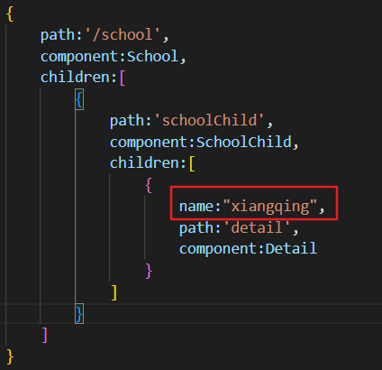

### 一、下载路由vue-router
Vue2项目需要使用router3版本：
~~~ cmd
npm i vue-router@3
~~~
Vue3项目不需要指定版本，直接安装即可：
~~~
npm i vue-router
~~~
### 二、引入并开启router
在main.js中引入router
~~~ js
//引入路由router
import VueRouter from 'vue-router'
//应用router插件
Vue.use(VueRouter)
~~~
### 三、在Vue中配置使用路由
**1.在src文件夹下创建路由器文件夹，一般命名为router**
**2.在文件夹中创建index.js并配置**
&nbsp;&nbsp;&nbsp;&nbsp;①先引入路由以及需要路由的组件
&nbsp;&nbsp;&nbsp;&nbsp;②创建路由对象、配置路由并暴露出去
~~~js
//本文件用于创建整个应用的路由器
import VueRouter from 'vue-router'
//引入需要路由的组件
import Studnet from '../components/student'
import School from '../components/school'

//创建router对象(路由器)，并暴露出去
export default new VueRouter({
    //在routes中创建路径和组件的kv关系
    routes:[
        {
            path:'/student',
            component:Studnet
        },
        {
            path:'/school',
            component:School
        }
    ]
})
~~~
**3.配置完路由之后，在mian.js导入自己配置的路由**
&nbsp;&nbsp;&nbsp;&nbsp;上面是路由的包
&nbsp;&nbsp;&nbsp;&nbsp;下面是自己配置的路由
&nbsp;&nbsp;&nbsp;&nbsp;注意，要在vue对象中配置自己的路由
~~~ js
//引入路由router
import VueRouter from 'vue-router'
//引入自己创建的路由器
import router from './router/index'

//创建Vue实例
new Vue({
  el:"#app",
  render: h => h(App),
  //给vue配置自己的路由
  router:router
})
~~~
**4.使用**
&nbsp;&nbsp;&nbsp;&nbsp;在对应的template标签中使用路由提供的标签
&nbsp;&nbsp;&nbsp;&nbsp;&nbsp;&nbsp;&nbsp;&nbsp;标签router-link最后会被变成a标签
&nbsp;&nbsp;&nbsp;&nbsp;&nbsp;&nbsp;&nbsp;&nbsp;属性active-class可以用来指定被选中的样式
&nbsp;&nbsp;&nbsp;&nbsp;在组件显示的位置使用标签router-view展示组件
~~~ html

    
    <!-- 原始html，使用a标签实现页面的跳转 -->
    <a href="http://www.baidu.com">跳转百度</a>
    <!-- 现在使用vue-router提供的特殊标签router-link,其最终也会变成a标签 -->
    <router-link active-class="active" to="/student">前往Student</router-link>
    <router-link active-class="active" to="/school">前往School</router-link>
    

      <!-- 指定路由选择后呈现的位置 -->
      <router-view></router-view>

~~~
### 四、路由命名
在路由的to属性中，path属性在多级路由时会变得很长，使用路由命名可以简化
**1.在路由的index.js中给对应的路由起名字**

**2.在to属性中使用**

