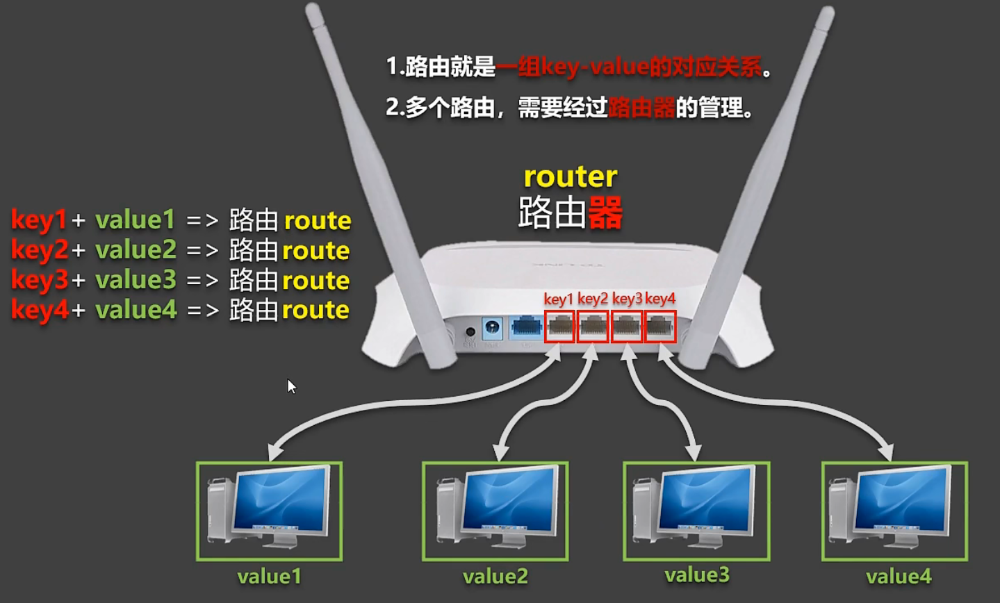
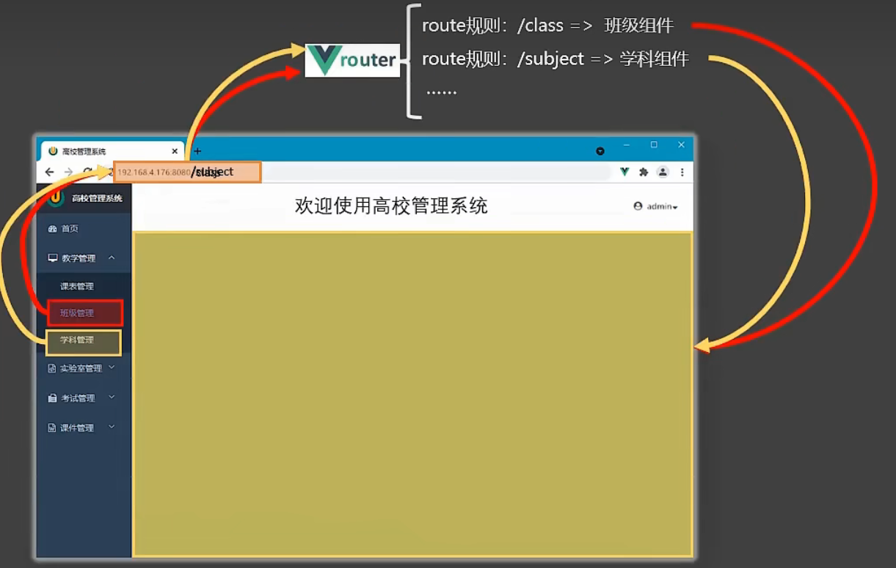
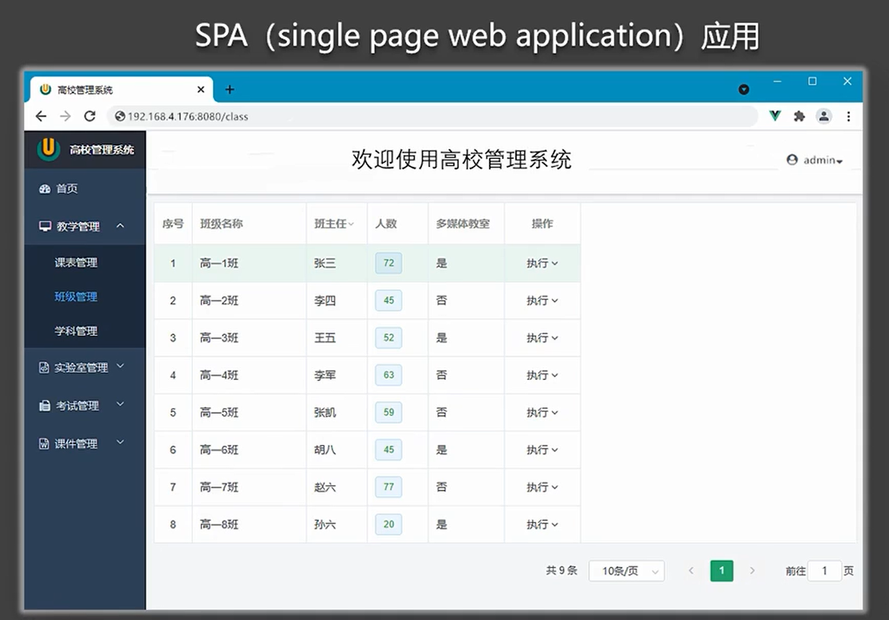

## 1.理解路由的概念
如图，路由其实就是一组key-value的对应关系。

而在vue中，一个路由相当于路径和组件的对应关系。

## 2.为什么使用单页面应用
&nbsp;&nbsp;&nbsp;&nbsp;多页面应用的缺点除了初学Vue时提到的复用复杂，结构复杂以外，还有一个比较显著的就是在使用时就是页面会闪烁，体验不好。
&nbsp;&nbsp;&nbsp;&nbsp;我们知道，vue是单页面应用，可以通过路由实现多页的功能，需要解决如下问题：
&nbsp;&nbsp;&nbsp;&nbsp;①组件根据需求进行跳转，且只是局部更新
&nbsp;&nbsp;&nbsp;&nbsp;②组件跳转同时要引起地址栏的变化，保存用户目前页面的信息，使得用户通过下次访问该地址依旧为目前页面。
## 3.Vue路由router
**1.是什么**
&nbsp;&nbsp;&nbsp;&nbsp;vue的一个插件库，专门用来实现SPA应用。
**2.SPA应用**
&nbsp;&nbsp;&nbsp;&nbsp;单页 Web 应用（single page web application，SPA）
&nbsp;&nbsp;&nbsp;&nbsp;整个应用只有一个完整的页面（即index.html）
&nbsp;&nbsp;&nbsp;&nbsp;点击页面中的导航链接不会刷新页面，只会做页面的局部更新
&nbsp;&nbsp;&nbsp;&nbsp;数据需要通过ajax请求获取
例如：

**3.路由的理解**
&nbsp;&nbsp;&nbsp;&nbsp;什么是路由？
&nbsp;&nbsp;&nbsp;&nbsp;&nbsp;&nbsp;&nbsp;&nbsp;一个路由就是一组映射关系（key - value）
&nbsp;&nbsp;&nbsp;&nbsp;&nbsp;&nbsp;&nbsp;&nbsp;key 为路径，value 可能是 function 或 componen
&nbsp;&nbsp;&nbsp;&nbsp;路由分类
&nbsp;&nbsp;&nbsp;&nbsp;&nbsp;&nbsp;&nbsp;&nbsp;后端路由：
&nbsp;&nbsp;&nbsp;&nbsp;&nbsp;&nbsp;&nbsp;&nbsp;&nbsp;&nbsp;&nbsp;&nbsp;value 是 function，用于处理客户端提交的请求
&nbsp;&nbsp;&nbsp;&nbsp;&nbsp;&nbsp;&nbsp;&nbsp;&nbsp;&nbsp;&nbsp;&nbsp;工作过程：服务器接收到一个请求时，根据请求路径找到匹配的函数来处理请求，返回响应数据
&nbsp;&nbsp;&nbsp;&nbsp;&nbsp;&nbsp;&nbsp;&nbsp;前端路由:
&nbsp;&nbsp;&nbsp;&nbsp;&nbsp;&nbsp;&nbsp;&nbsp;&nbsp;&nbsp;&nbsp;&nbsp;value 是 component，用于展示页面内容
&nbsp;&nbsp;&nbsp;&nbsp;&nbsp;&nbsp;&nbsp;&nbsp;&nbsp;&nbsp;&nbsp;&nbsp;当浏览器的路径改变时，对应的组件就会显示