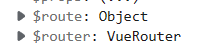
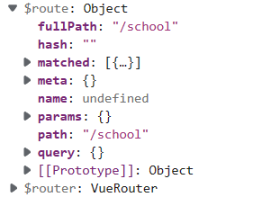
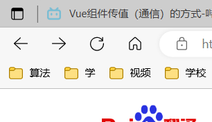

### 一、组件分为两种
**1.一般组件components**
&nbsp;&nbsp;&nbsp;&nbsp;在App.vue中导入，并配置到components中，然后手动用标签写到template中的组件
&nbsp;&nbsp;&nbsp;&nbsp;这类组件一般都放在components文件夹下
~~~ js
<template>
  

    <Header></Header>
  

</template>

~~~
**2.路由组件pages**
&nbsp;&nbsp;&nbsp;&nbsp;这类组件是由路由所管理，不需要在vm中导入自己手动在template中写标签的。
~~~ html
<template>
  

    <router-link active-class="active" to="/student">前往Student</router-link>
    <router-link active-class="active" to="/school">前往School</router-link>
    

      <router-view></router-view>
    

  

</template>
~~~
### 二、路由组件不使用之后去路
&nbsp;&nbsp;&nbsp;&nbsp;路由组件在不适用之后就默认是被销毁了
证明：
&nbsp;&nbsp;&nbsp;&nbsp;在School组件中加一个钩子beforeDestory
&nbsp;&nbsp;&nbsp;&nbsp;然后使用School组件之后切换，会发现控制台输出“School组件即将销毁”
~~~ js

~~~
### 三、路由组件的组成
&nbsp;&nbsp;&nbsp;&nbsp;在路由组件中添加一个钩子，在挂载完毕中输出this，也就是本组件
&nbsp;&nbsp;&nbsp;&nbsp;其中：
&nbsp;&nbsp;&nbsp;&nbsp;&nbsp;&nbsp;&nbsp;&nbsp;route是每个路由组件不同的
&nbsp;&nbsp;&nbsp;&nbsp;&nbsp;&nbsp;&nbsp;&nbsp;router则是路由器，所有组件都有，且为同一个

&nbsp;&nbsp;&nbsp;&nbsp;route内容：

### 四、router-link的replace属性
**浏览器的回退和前进的操作**
&nbsp;&nbsp;&nbsp;&nbsp;这其实就是一个栈，每次点击新链接就入栈，回退就出栈。

**a标签(链接)默认就是入栈操作**
&nbsp;&nbsp;&nbsp;&nbsp;即router-link的组件，每次点击都会入栈新地址
**router-link的replace**
&nbsp;&nbsp;&nbsp;&nbsp;使用replace属性后，每次就是替换栈顶，而不是入栈
~~~ html
<router-link :replace="true" 
  :to="{
      name:'xiangqing',
      query:{
          id:m.id,
          name:m.name
      }
  }">
      消息{{ m.id }}
  </router-link>
~~~