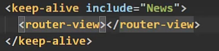

### 一、this.\$router
&nbsp;&nbsp;&nbsp;&nbsp;之前，路由跳转都需要router-link生成a标签以外。但是这样有很大局限，最后会生成一个a标签，且不能在方法里进行跳转。
**路由式编程导航：**
&nbsp;&nbsp;&nbsp;&nbsp;直接使用this.\$router.push()&nbsp;&nbsp;&nbsp;&nbsp;//replace等方法也一样
&nbsp;&nbsp;&nbsp;&nbsp;这个方法相当于点击了router-link标签
&nbsp;&nbsp;&nbsp;&nbsp;这个方法传入的参数与router-link标签的to属性一致
~~~js
this.$router.push({
    name:'',
    query:{

    }
})
~~~

### 二、缓存路由组件
&nbsp;&nbsp;&nbsp;&nbsp;一般来说，当路由切换时，原来的路由将被直接销毁，其内部的消息也会直接清空。
&nbsp;&nbsp;&nbsp;&nbsp;我们想要保留路由，当期切换回来内部信息还都存在
&nbsp;&nbsp;&nbsp;&nbsp;使用keep-alive标签，其内部的router-view路由将会被缓存而不是销毁，不添加include表示所有路由都缓存，加了之后，只有Include内包含的组件才会被缓存

### 三、路由守卫
&nbsp;&nbsp;&nbsp;&nbsp;用来保护路由的安全(权限)。
在router创建实例的时候，配置其beforeEach():
~~~js
//全局前置路由守卫
//表示每一次路由切换之前都会调用参数里的函数(初始化时也会)
router.beforeEach((to, from, next) => {
    /*
        该函数有三个参数：
            to:表示即将跳转的路由，目的路由
            from:表示来自哪个路由，当前路由
            next:是一个函数，表示放行
    */
    //这样就可以动态判断是否放行
    //下面表示先判断是否前往个人中心，如果是就从localStorage中判断是否用户名为张三，是则放行
    if(to.path==='user/myself' || to.name==='gerenzhongxin'){
        if (localStorage.getItem('user') === '张三') {
                next()
        }
    }else{
        next()
    }
})
~~~

