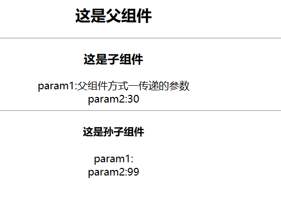
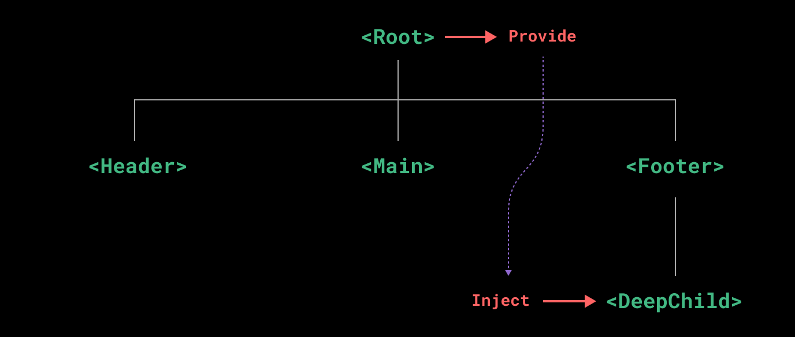

### 基础结构
父组件：
~~~ js
<template>
    

        <h2>这是父组件</h2>
        

        <Son></Son>
    

</template>

~~~
子组件：
~~~ js
<template>
    

        <h3>这是子组件</h3>
        

        <GrandSon></GrandSon>
    

</template>

~~~
孙子组件:
~~~ js
<template>
    

        <h4>这是孙子组件</h4>
    

</template>

~~~
#### 一、通过props
&nbsp;&nbsp;&nbsp;&nbsp;父传子很方便，父传孙需要子再传孙一次
**1.使用**
&nbsp;&nbsp;&nbsp;&nbsp;父组件在使用子组件时，直接在标签后加入要传递的参数
&nbsp;&nbsp;&nbsp;&nbsp;子组件在接收时，通过props属性接收，然后直接插值语法使用即可
父组件：
~~~ html
<Son param1="父组件方式一传递的参数" :param2="30"></Son>
~~~
子组件：
~~~ js
<template>
    

        <h3>这是子组件</h3>
        param1:{{ param1 }}
         
        param2:{{ param2 }}
    

</template>

~~~
**2.细节点**
&nbsp;&nbsp;&nbsp;&nbsp;props的优先级比data中的数据高
&nbsp;&nbsp;&nbsp;&nbsp;&nbsp;&nbsp;&nbsp;&nbsp;即当data和props中有同名参数时，会使用props的中的值
&nbsp;&nbsp;&nbsp;&nbsp;因此，可以在data中接收props中的数据
&nbsp;&nbsp;&nbsp;&nbsp;&nbsp;&nbsp;&nbsp;&nbsp;在data中接收props参数的原因是：
&nbsp;&nbsp;&nbsp;&nbsp;&nbsp;&nbsp;&nbsp;&nbsp;&nbsp;&nbsp;&nbsp;&nbsp;vue不允许改变props中的数据，所以要放到data中使用
**3.缺点**
&nbsp;&nbsp;&nbsp;&nbsp;父亲传递的数据，无法直接给孙子使用，需要儿子中转
&nbsp;&nbsp;&nbsp;&nbsp;如上面例子，father给son传递了param1和param2两个参数，GrandSon组件直接使用：
~~~html
<template>
    

        <h4>这是孙子组件</h4>
        param1:{{ param1 }}
         
        param2:{{ param2 }}
         
    

</template>
~~~
结果：
&nbsp;&nbsp;&nbsp;&nbsp;只有param2有默认值，param1没有值
&nbsp;&nbsp;&nbsp;&nbsp;说明father的参数grandson没有接收到

#### 二、通过$parent
**1.使用**
&nbsp;&nbsp;&nbsp;&nbsp;子组件有一个$parent属性，可以通过这个属性获得父组件的所有信息，也就可以通过这个获取父组件的数据
&nbsp;&nbsp;&nbsp;&nbsp;(不算是传递，而是子组件直接使用父组件的数据)
&nbsp;&nbsp;&nbsp;&nbsp;孙子组件可以通过\$parent.\$parent来获取father的数据了
父组件:
&nbsp;&nbsp;&nbsp;&nbsp;直接使用子组件标签，没有传递参数
~~~ js
<template>
    

        <h2>这是父组件</h2>
        

        <Son></Son>
    

</template>

~~~
子组件：
&nbsp;&nbsp;&nbsp;&nbsp;通过$parent来获取参数
~~~ js
<template>
    

        <h3>这是子组件</h3>
        param1:{{ $parent.param1 }}
         
        param2:{{ $parent.param2 }}
         
        

        <GrandSon></GrandSon>
    

</template>

~~~
**2.缺点**
&nbsp;&nbsp;&nbsp;&nbsp;使用这种方式，子组件不能直接修改父组件的数据

#### 三、provide 和 inject
**1.使用**
&nbsp;&nbsp;&nbsp;&nbsp;一个父组件相对于其所有的后代组件，会作为**依赖提供者**。任何后代的组件树，无论层级有多深，都可以注入由父组件提供给整条链路的依赖。
&nbsp;&nbsp;&nbsp;&nbsp;这样如果中间组件(son)不需要使用某些数据，而grandson组件需要使用father的数据，就不需要son再传递一次了

父组件(provide):
~~~js

~~~
孙子组件(inject):
~~~ js
<template>
    

        <h4>这是孙子组件</h4>
        param1:{{ p1 }}
         
        param2:{{ p2 }}
         
    

</template>

~~~
**2.细节点**
&nbsp;&nbsp;&nbsp;&nbsp;注入会在组件自身的状态之前被解析，因此你可以在 data() 中访问到注入的属性。
~~~ js
export default {
        name: 'GrandSon',
        data(){
            return{
                data1:this.p1
            }
        },
        inject:{
            p1:{
                from:'param1',//该属性表示来自provide的哪个属性
                default:'默认值'//该属性表示默认值
            },
            p2:{
                from:'param2',
                default:99
            }
        }
    }
~~~