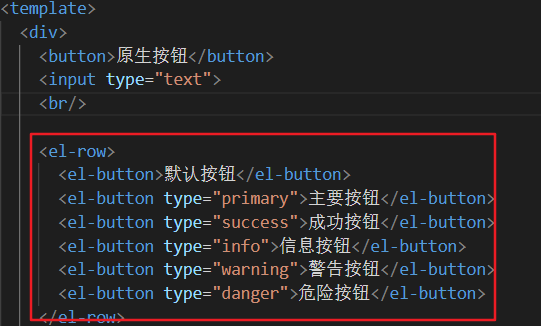

1.安装
~~~ js
npm i element-ui -S
~~~
2.引入
在main.js中引入
~~~ js
//引入ElemnetUI组件库
import ElementUI from 'element-ui'
//引入ElementUI全部样式
import 'element-ui/lib/theme-chalk/index.css'
//应用ElemnetUI
Vue.use(ElementUI)
~~~
3.使用
在任何一个.vue里都可以使用

4.按需引入
